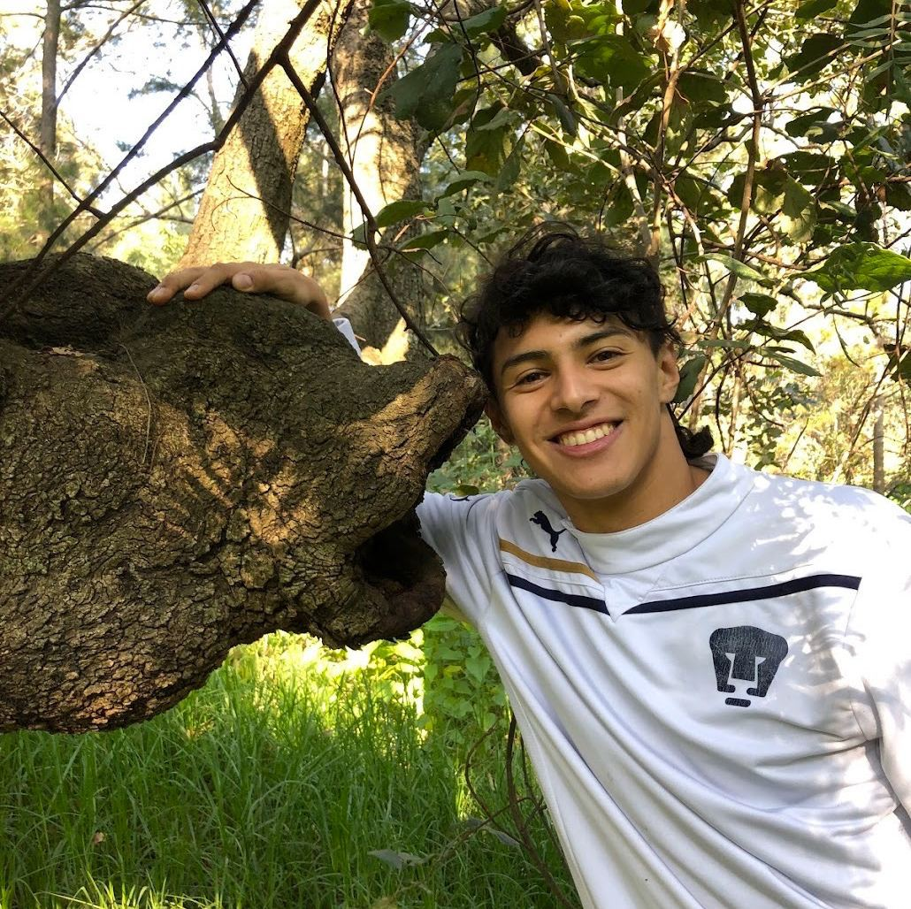

.ve-header "Species Stories" wc:Sunflower.jpg "Cultural and Environmental Histories of Introduced Species in Singapore and Southeast Asia" pct:10,25,80,60 center sticky
    - [Home](/)
    - [About](/about)
    - [Authors](/authors)
       
### Story Authors {.cards}

####  Foo Shi Wen

Shi Wen is a student at Yale-NUS college.

####  Dünya Gürses

####  Angela Ricasio Hoten

####  Joyce Hu

####  Jody Lim

####  Max D. López Toledano

Max(they/she) did their undergraduate studies in Anthropology at Yale-NUS College. Their research interests are broad, including sports, environmental anthropology, and STS, though queer and decolonial perspectives are always part of her work. Max is also a football player and a long-distance runner.

####  Yeo Hui Qing

####  Yoon Sun Woo

